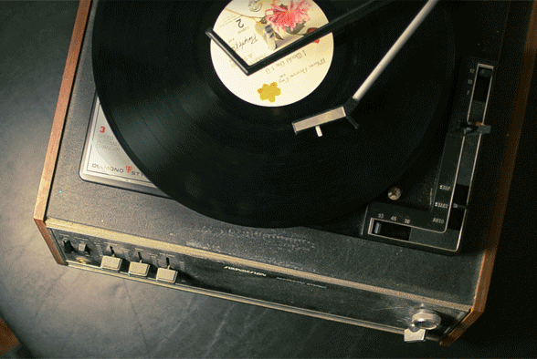

# IASC 2P02 | Aaron Coomber

I am a 3rd year student currently majoring the Interactive Arts and Science program.  

When relating to the field of digital humanities I am greatly interested in patterns within search engine queries. By following along with trends, you can ascertain a lot of minute detail about that time frame. As such, I would like to take that knowledge of working with these search trends and apply them in a demonstrative way.
Throughout IASC 2P02 I’ve had the opportunity working with Google Trends as well as other tools that deal with analyzing the minutia of information such as Voyant. As well, I’ve been able to work with software that can professional present information such as Reveal.js, and Palladio.

What I hope to do going forward is by working with Youtubers and Twitch Streamers to help grow their platforms by analyzing Google Trends and presenting my findings using a tool like Palladio. By analyzing patterns in internet searches and by seeing the trends of different things going viral, I will be able to help guide my clients to follow those trends and develop their platforms further.

### Featured Project

### The Importance of the Record Player

**Abstract**

Music today is defined by the popularity and success of the record player. By allowing artists to reach a wider array of audiences around the world, the record player becomes synonymous with the printing press in regards to its impact on global culture.

When designing the presentation the goal was to outline how the record player is not a relic of the past, but instead the godfather of modern music playing capabilities that is having a sudden resurgence in the past years. As well, the inclusion of the comparison between analog and digital sound waves was paramount to drive home the point that digitally produced music is not objectively better than analog.

Over the course of designing the presentation, details about how important the record player and analog format music was shown. Within the 50s to early 80s the record player hit its tallest stride in popularizing different genres of music in different areas of the world. By being able to reach audiences globally, music bands were able to skyrocket in popularity and become wildly successful household names.

It is important to always remember the contributions of media from the past. After the switch to tapes, then CDs, then purely digital, the success of globally accessible music relies on the record player.

**Research Process**

Before undergoing the task of developing this presentation I had very limited knowledge of the fine details about record players since I did not grow up with one. The CD Walkman was what I was first introduced to as a child in regards to devices that can play music. As such, I wanted to try to include as much as I could about how a record player actual works, this can be shown with the two animated slides about how a record gets played. Originally, I just had animations of records spinning on a record player but I later changed that to include the details about how miniscule the grooves are on a record.

Continually, after receiving feedback about trying to include more details about media archeology I had to determine the best way to include that information without interrupting the previously established flow of slides. What I decided upon doing was changing the second slide about the Beatles. Previously, the slide would discuss the reasoning behind their massive popularity can be somewhat associated with the accessibility of records. In the latest version of the slide, it discusses that as a continuation of their popularity with records, the Beatles are still top sellers on ITunes and are streamed continuously on Spotify.  By analyzing the past, it is shown that the trend of popularity of a band such as the Beatles does not dwindle as they have dominated new media platforms for decades.

By diving deep into the minutia of detail about record players, I have extended my knowledge on the history of music. The slow transfer from being analog-based to digital-based caused much upheaval in musical communities, but that is what ultimately happened.

[Blog Post](publish_blog_post.md)

[Solo Presentation](reveal_working/presentation2.html)
