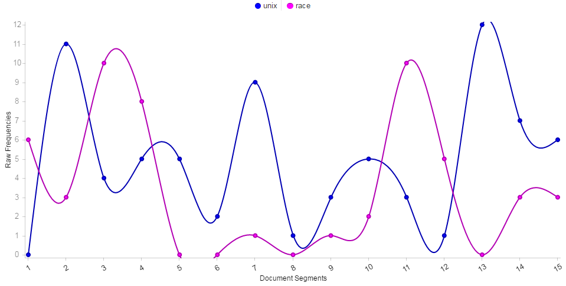

# GitHubAaronC.github.io
# McPherson: How To Find A Correlation When There Isn’t One

Topics within the digital humanities are very intricate since connections can be made from various different ideas. However, there is a limit to the degree to which someone can skew their writing and make it seem like there is a correlation between topics when there isn’t one. In the case of McPherson, she tries very hard using many different literary techniques to prove her thesis but ultimately falls flat on her face when trying to do so. By having a very weak thesis, writing in a way as to put off the laymen from reading, and not utilizing data to back her ideas up, McPherson’s writing is not coercive and most definitely not accurate.  
 	
McPherson’s idea about the connection between UNIX and race is very interesting, but seems to be connected with no actual discernable proof. The concept of UNIX and race being, “deeply interdependent” of one another is simply not true. Or, at the very least, McPherson is tackling this thesis in the wrong direction. McPhersons says that, “the programmers themselves do not explicitly understand their work to be tied to such racial“, in that the modularity and invisibility of some code execution that the programmers developed makes UNIX be connected to race. This is simply not true. The idea that, “modularity and the covert in digital computation also reflects other changes in the organization of social life”, is a connection based around racial differences being modular, and UNIX being modular. Just being modular doesn’t allow for the two different topics to be connected. A computing system is absolute, ones and zeros. Following protocols and different methods makes it so a computer’s operating system completes its tasks efficiently. An operating system cannot be racist unless a programmer specifically designed it to be like that. The operating system would have to directly confront the user about their race and act differently according to that to be able to deem it to be racist.  
 
To connect UNIX to racism, is something without bearing. An actual direction that McPherson could have gone would be to connect race with the actual interaction between a user and an operating system. How does race affect computer usage? This is touched upon in the article, Race, Gender, and Information Technology Use: The New Digital Divide. Throughout testing it was discovered that, “African American males were the least intense users of computers and the Internet, whereas African American females were the most intense users of the Internet” (Jackson et al. 2008). This information is very interesting and could have been followed through and explored upon in McPherson’s writing, but she did not go down that avenue.  
 
Instead, McPherson tried to cover up her shaky thesis by writing is such a way as to isolate the layman. The use of complex terms and phrasing structures puts a sort of air about her writing as to try to make it look professional. Let’s take a look at this excerpt from the writing: “The emergence of covert racism and its rhetoric of color blindness are not so much intentional as systemic. Computation is a primary delivery method of these new systems, and it seems at best naïve to imagine that cultural and computational operating systems don’t mutually infect one another.” The writing talks about covert racism being systemic and that it would be naïve to not recognize the connection between this cultural racism and a computational operating system. The whole act of putting the word, “naïve” in the writing removes any credence to it. McPherson should be trying to prove her thesis with logic and facts but instead writes colorful lines about the connection and mocks the reader if they don’t recognize what she is saying as true. It would be naïve to not recognize the connection between the size of an elephant’s trunk and the amount of rain the southern Africa gets. This is what her writing sounds like, trying to connect things that have no correlation and trying to indicate that there is one by saying that it is naïve to not recognize it. Her writing is simply vapid and offers no meaning to her thesis.  
 
As well, her writing deserves even less credence because of her lack of actual data. Data is the be all and end all when it comes to proof. The whole scientific field is based around proving hypotheses as much as possible by using data as reasonable proof. McPherson should know that yet does not implement any data into her writing. This contrasts hugely with the way Moretti goes about writing. When talking about the correlation between time and literary genres/amount of publications, Moretti implements an extensive list of graphs in order to directly show the relation. Having this visual aid allows readers to be able to see the trends that Moretti talks about and be able to see different peaks without them having to be brought up within the writing. Moretti also speaks of quantitative research being, “a type of data which is ideally independent of interpretations.” This can be shown in his work where the reader cannot question the proofs behind his writing since there is data that is backing him up. Compare this in contrast to McPherson where her whole article is all based around interpretations. She interprets her research in her own way and fails to guide the reader into believing her words. Interpretations are less likely to prove a point than data.  
 
Additionally, when analyzing McPherson’s writing in an empirical way it can be shown that there is no correlation between UNIX and race in the structure of her writing.  
 

 
As such, I honestly believe McPherson’s writing is not at all accurate. This correlation between race and UNIX is completely unfounded and simply does not exist.   
